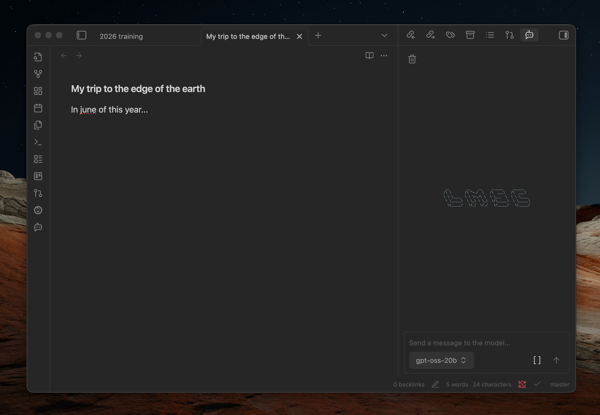
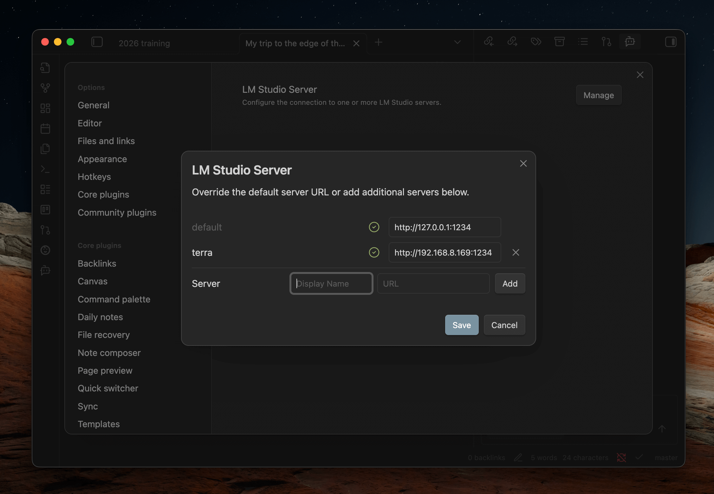
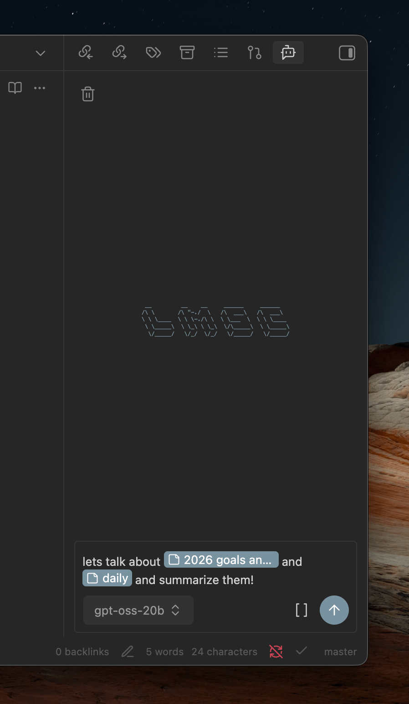

<pre>
 __         __    __     ______     ______   
/\ \       /\ "-./  \   /\  ___\   /\  ___\  
\ \ \____  \ \ \-./\ \  \ \___  \  \ \ \____ 
 \ \_____\  \ \_\ \ \_\  \/\_____\  \ \_____\
  \/_____/   \/_/  \/_/   \/_____/   \/_____/
</pre>

## LM Studio Connect

An [Obsidian](https://obsidian.md) plugin that provides an AI Chat interface to an [LM Studio](https://lmstudio.ai) instance.  Allows you to
use LLMs with your notes privately and offline.

[Bugs, Issues, and Feature Requests](https://github.com/joepetrakovich/obsidian-lmstudio-connect/issues)

### How to use
- First, ensure you have LM Studio set up on your machine and that the [server](https://lmstudio.ai/docs/developer/core/server) is enabled **with the CORS option**.
*Note: If you plan on using this plugin on your phone, you may want to enable the "Serve on local network" setting as well, although you may need to change firewall settings.*
- Once the plugin is installed, visit the plugin's settings page in Obsidian and verify it can connect to LM Studio.

### Chat view
- You can reveal the chat window via the Obsidian command pallete or ribbon menu.
- To chat with notes, begin typing '[[' to open a file picker or use the file picker 
button at the bottom of the chatbox.
- The LLM is also made aware of your current open notes so you can talk about them without referencing them explicitly.

### Codeblock prompts
You can also embed a prompt directly in your notes using a fenced codeblock with the `lmsc` language identifier:

~~~
```lmsc
prompt: What's hot on reddit today?
```
~~~

**Options:**
- `prompt` (required) - The prompt to send to the LLM
- `hideToolUse` (optional, default: `false`) - When `true`, hides tool call details from the response





*Note: Not affiliated with the official LM Studio company, Element Labs, Inc.*
